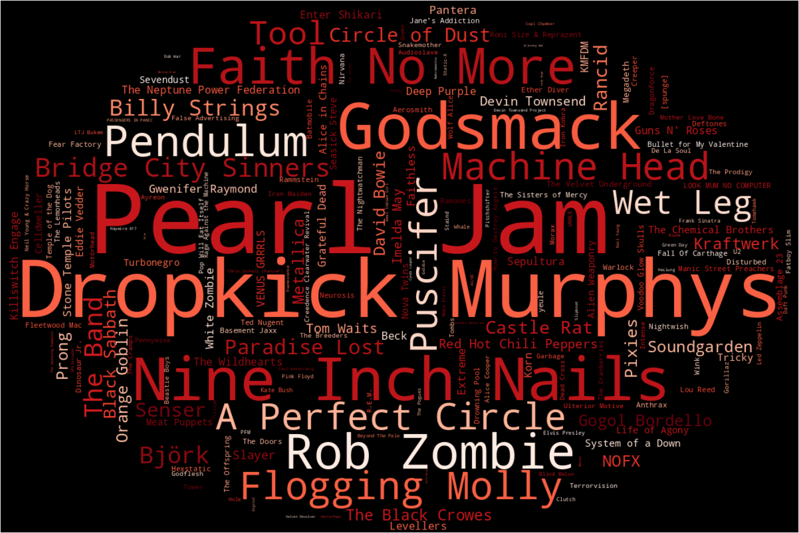
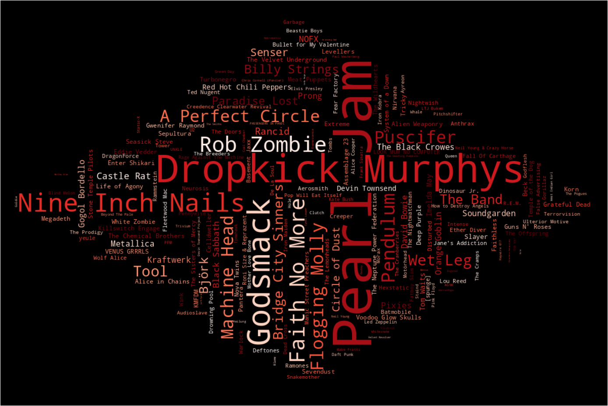
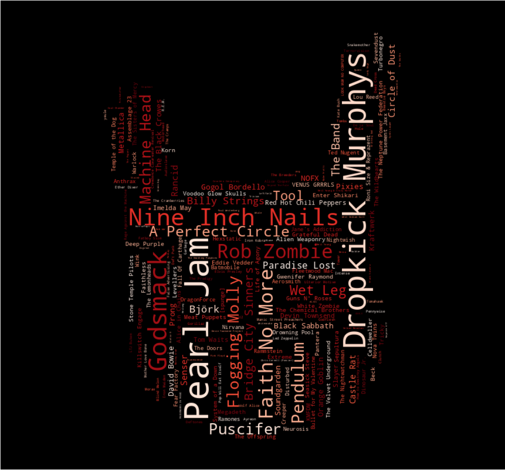

## last.fm Word Cloud Generator
  
A python script to generate a wordcloud from you top artists scrobbled to [last.fm](https://last.fm).  
  
#### Requirements

The script has the following Python requirements:
`numpy`
`wordlcloud`
`PIL`
`matplotlib`
`requests`
`json`
`argparse`
  
`pip install -r requirements.txt`

You will need to generate your own last.fm api key, from here:  
[https://www.last.fm/api/account/create](https://www.last.fm/api/account/create)

#### Usage
  
TO run the script, use the following command parsing in the two required parmeters, this will create a file named "artist_cloud.png" with the last 12 months top 200 artists in a red colour scheme.  
`python word_cloud.py -u username -a your_api_key`  
  
There are severa;l optionalcomponents to change the period, masks, colour and limit of artists included.
```
  -a, --api_key API_KEY
                        Your last.fm api key, reuqired. You can create one here https://www.last.fm/api/account/create.
  -u, --user USER       Your last.fm username, required.
  -p, --period [PERIOD]
                        The period you want to generate over, defaults to 12 months. Acceptable periods: overall | 7day | 1month | 3month | 6month |
                        12month
  -l, --limit [LIMIT]   Maximum number of artists to retreive, defaults to 200
  -m, --mask [MASK]     Select a png file to use as a maks to change the output shape. There are sample masks in the 'masks' folder. Default os oval.png
  -c, --colour [COLOUR]
                        A colour for your text to appear in, defaults to red. Some useful values: Blues, Greens, Blues, Greys, and Purples. Full list can
                        be found in the colour_values.txt file.
```

#### Sample Images
  
Oval mask sample.  
  
  
Diamond mask sample.  
  
  
Horns mask sample.  
  